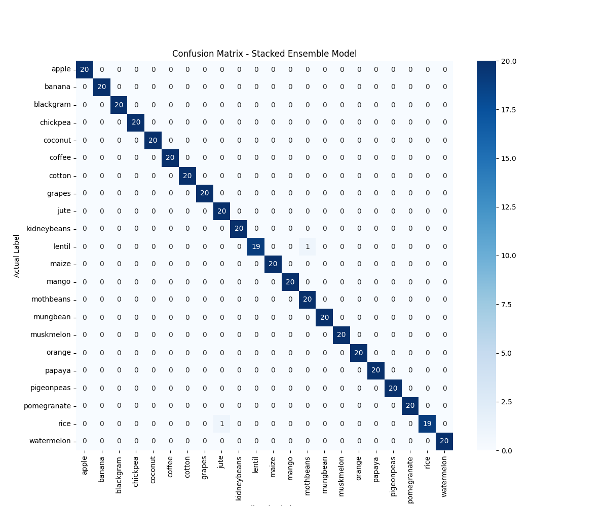
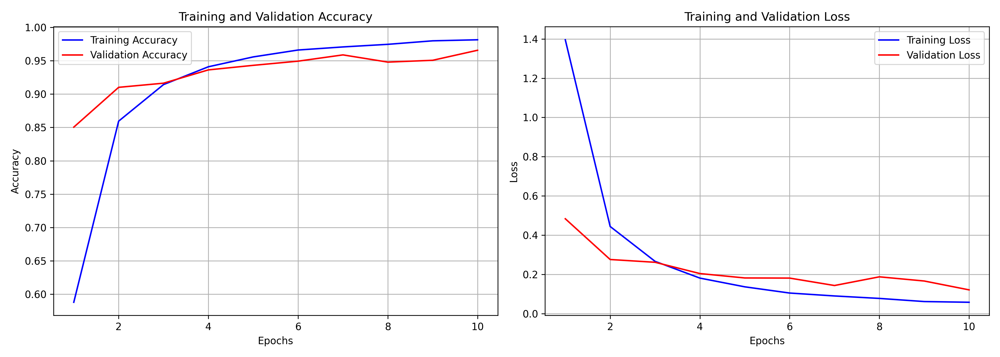

# Krishi Mitra: AI-Powered Farm Management Assistant
**Comprehensive Technical Documentation**

---

## 1. Executive Summary

Krishi Mitra is a state-of-state, end-to-end farm management application designed to empower farmers with data-driven and AI-backed insights. Initially conceived as a collection of disjointed machine learning tools, the project has evolved into a cohesive, intelligent platform featuring a live Farm Management Dashboard, seamless Dark Mode support, and an advanced LLM-powered Chatbot Assistant that acts as a central orchestrator. 

By leveraging predictive models for crop recommendation, fertilizer application, disease identification, and market price forecasting, Krishi Mitra aims to optimize resource utilization, increase yield, and maximize profitability in agriculture.

---

## 2. Frontend & UI/UX Architecture

The frontend is built with **React** and **Vite**, focusing on speed, responsiveness, and a premium aesthetic.

### Key Features:
- **Farm Management Dashboard**: A dynamic milestone tracker allowing users to manually advance their crop through specific farming stages (Soil Preparation, Planting, Watering, Fertilizer, Harvesting, Market). It provides contextual "Next Step" advice based on current progress.
- **Global Dark Mode**: Implemented via a robust CSS variable overriding system (`data-theme="dark"`). This seamless toggle ensures all components, including third-party widgets and custom modals, respect the user's preference for reduced eye strain.
- **Floating Chatbot Widget**: A conversational UI integrated directly into the application. It supports real-time text streaming (Server-Sent Events) for a natural typing effect, markdown parsing, and direct image uploads for disease diagnosis.
- **Interactive Guides**: The "How to Use" section serves as a comprehensive onboarding manual, guiding users on utilizing recommendations, tracking farm activities, and engaging with the AI assistant.

---

## 3. Backend & AI Orchestration

The backend is powered by **FastAPI**, serving both traditional REST endpoints for ML inference and asynchronous streaming endpoints for the AI Chatbot.

### The Chatbot Orchestrator (Gemini Integration)
To provide a unified experience, a sophisticated service layer was built around Google's Gemini API:
- **Tool Routing**: Instead of relying on a generic LLM response, the Chatbot utilizes Gemini's Function Calling capabilities. When a user asks a question, the LLM maps the intent to internal API tools (e.g., `predict_crop`, `get_weather`, `identify_disease`).
- **Knowledge Base Injection**: The Chatbot is equipped with an internal vector/document store (`CHATBOT_DOCUMENTATION.md`, etc.), ensuring its responses are heavily grounded in the project's specific domain context.
- **Image Processing Integration**: Users can upload images of diseased crops directly to the chat interface. The backend processes the base64 image data and routes it to the specific Disease Identification model.

---

## 4. Machine Learning Models Deep-Dive

Krishi Mitra utilizes four distinct predictive models, each tailored for a specific agricultural challenge.

### 4.1 Crop Recommendation (Stacked Ensemble)
**Objective**: Recommend the optimal crop based on soil nutrients (N, P, K), pH, and environmental factors (Temperature, Humidity, Rainfall).

- **Architecture**: We implemented a Stacked Ensemble approach to capture complex non-linear patterns.
  - *Base Learners*: Random Forest Classifier & Gradient Boosting Classifier.
  - *Meta-Learner*: A secondary Random Forest trained on the base models' predictions.
- **Performance**: This approach yielded an exceptional accuracy of **~98.86%** on the 22-class dataset.

**Model Accuracy Comparison Graph:**

### 4.2 Plant Disease Identification (CNN)
**Objective**: Visually diagnose plant diseases from leaf imagery to enable rapid treatment.

- **Architecture**: A Custom Convolutional Neural Network (CNN) built with TensorFlow/Keras.
  - Utilizes multiple `Conv2D` layers with ReLU activation for feature extraction, followed by `MaxPooling2D` for downsampling.
  - Flattening and dense layers map the visual features to distinct disease classes using `softmax` classification.
- **Training Details**: Trained using the Adam optimizer (learning rate: 0.0001) with Categorical Crossentropy loss over 10 epochs.
- **Performance**: The model converged rapidly, achieving an impressive validation accuracy of over **96%**.

**Training and Validation History:**

### 4.3 Fertilizer Recommendation
**Objective**: Suggest the most appropriate fertilizer to bridge soil nutrient gaps.

- **Architecture**: A Random Forest Classifier with `n_estimators=100`.
- **Inputs**: Soil type, Crop type, Moisture, ambient conditions, and soil N-P-K levels.
- **Outputs**: Maps the input vector to commercially available fertilizers (e.g., Urea, DAP, 14-35-14).
- **Deployment**: Integrated directly into the FastAPI backend alongside serialized `LabelEncoders` to handle categorical inputs gracefully.

### 4.4 Market Price Prediction
**Objective**: Forecast agricultural commodity modal prices to help farmers time their market entry.

- **Architecture**: A Random Forest Regressor optimized for time-series and categorical interaction.
- **Dataset**: Trained on ~836,977 historical records from APMC markets across India spanning 249 commodities.
- **Features**: Commodity Name, State, District, Market, and Target Month.
- **Performance**: Achieved an **R² Score of ~0.8688**, indicating strong predictive capability for 6-month forecasting windows.
- **Deployment**: The model handles unseen market categories robustly through specialized 'Unknown' class fallbacks within its custom encoders.

---

*This document summarizes the culmination of the Krishi Mitra project, unifying predictive machine learning with modern web architecture and agentic AI orchestration.*
